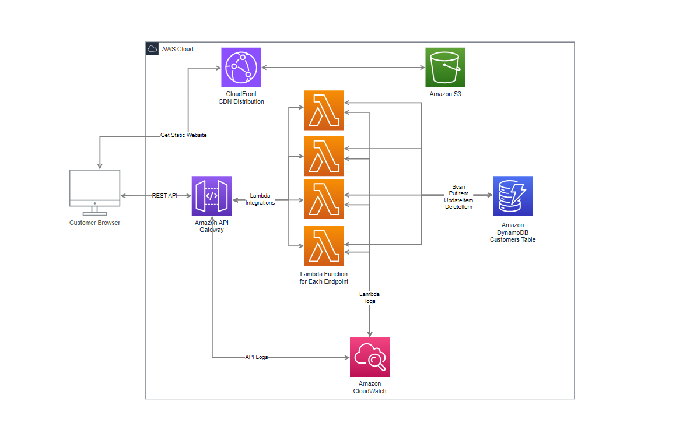

# Serverless Customer Management Application Documentation

This is a simple customers management application, deployed in a cloud native serverless architecture.

## Region and Infrastructure Overview

The application was deployed in the **eu-west-3 (Paris)** AWS region.

All resources were created using **AWS-managed infrastructure**. No custom VPC, subnets, or availability zones were explicitly configured — AWS provisioned these automatically as part of the managed services.

### AWS Services Used
- **Amazon API Gateway (REST API)** — to expose HTTP endpoints for managing customer data.
- **AWS Lambda** — Node.js functions implementing Create, Read, Update, and Delete operations.
- **Amazon DynamoDB** — NoSQL database for storing customer information.
- **Amazon S3** — static website hosting for the frontend.
- **Amazon CloudFront** - CDN distribution serving the static files stored in S3.
- **AWS IAM** — managing permissions with least-privilege access.
- **Amazon CloudWatch** — monitoring and logging.

---

## Architecture Diagram

---

## Amazon DynamoDB
A DynamoDB table named **`Customers`** was created with:
- **Primary Key**: `customerId` (String)
- **Attributes**: name, email, and phoneNumber.

---

## Amazon API Gateway (REST API)
We implemented a **REST API** in API Gateway with the following characteristics:

- Integrated with AWS Lambda functions for backend logic for each of the endpoints.
- Endpoints:
  - **POST `/customers`** — Create a new customer.
  - **GET `/customers`** — Retrieve all customers.
  - **PUT `/customers/{customerId}`** — Update an existing customer.
  - **DELETE `/customers/{customerId}`** — Delete a customer.

---

## AWS Lambda Functions
The backend logic is handled by AWS Lambda functions written in **Node.js**.  
Each function includes logging via **Amazon CloudWatch Logs** for easier debugging and monitoring.

Lambda functions have **IAM policies granting only the necessary permissions**:
- `dynamodb:PutItem`
- `dynamodb:Scan`
- `dynamodb:UpdateItem`
- `dynamodb:DeleteItem`

---

## Amazon S3 Static Website Hosting
The frontend is a static website hosted on **Amazon S3**, consisting of:
- An `index.html` file containing a form for creating, updating, and deleting customers.
- JavaScript to call the REST API endpoints via `fetch`.

The S3 bucket was configured with:
- **Static website hosting** enabled
- **Policy** allowing GetObject from the cloudFront distribution.

---

## Amazon CloudFront
Amazon CloudFront was added as a Content Delivery Network (CDN) in front of the Amazon S3 bucket that hosts the static website.  
The distribution is responsible for caching and accelerating static assets (HTML, CSS, JavaScript, images).

---

## Amazon CloudWatch
Amazon CloudWatch was used for monitoring and logging across the application, specifically integrated with **AWS Lambda** functions and the **Amazon API Gateway**.

---
